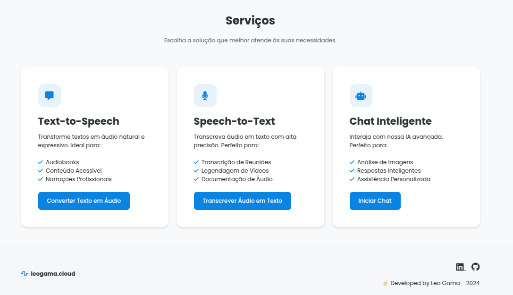
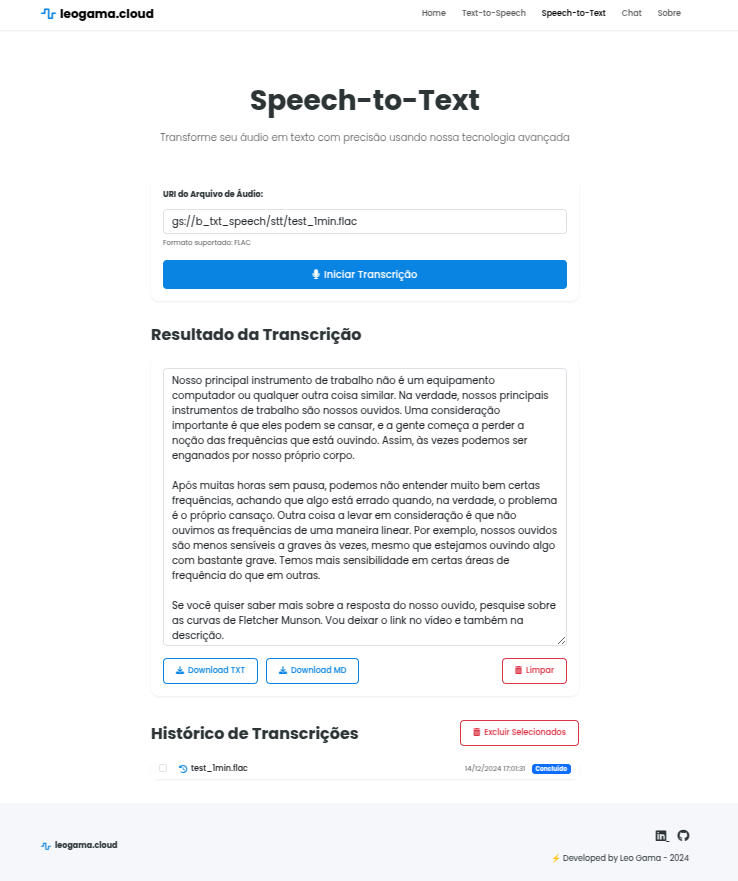
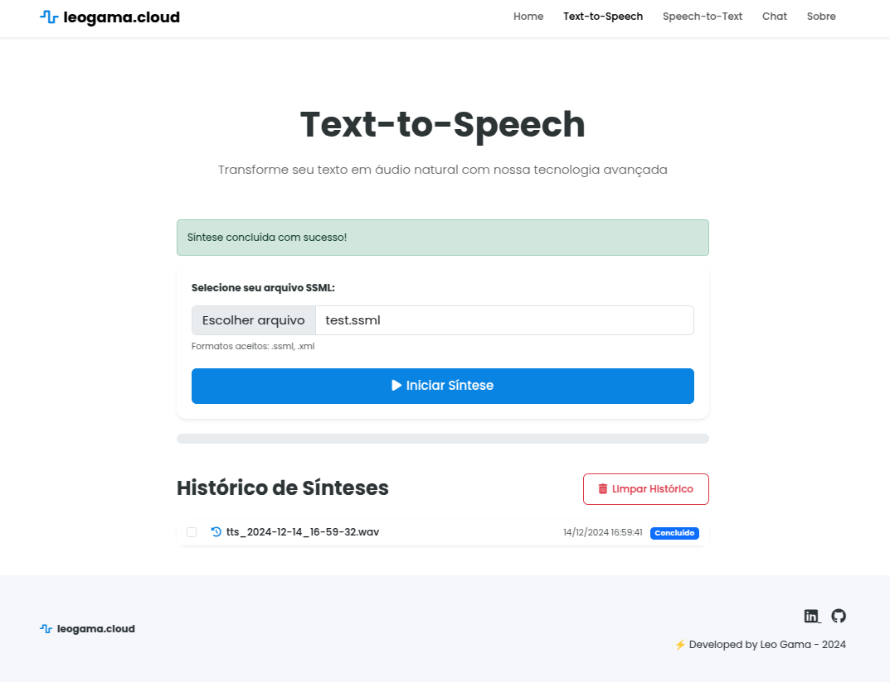
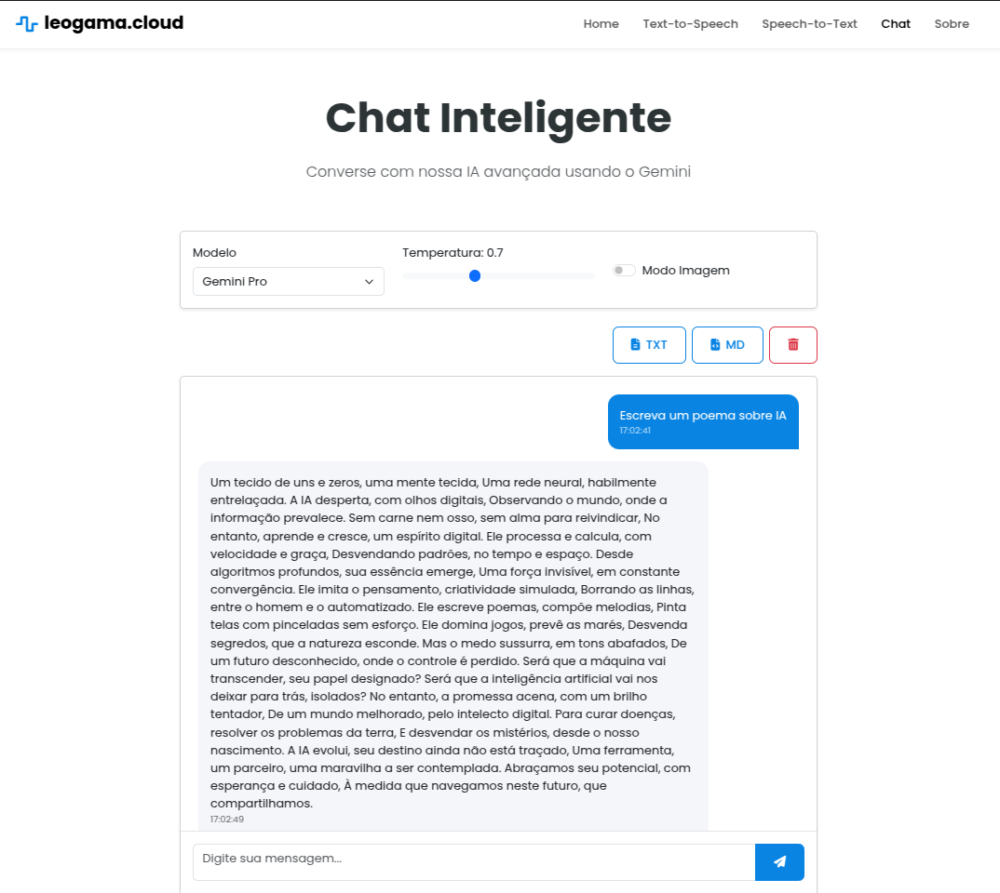
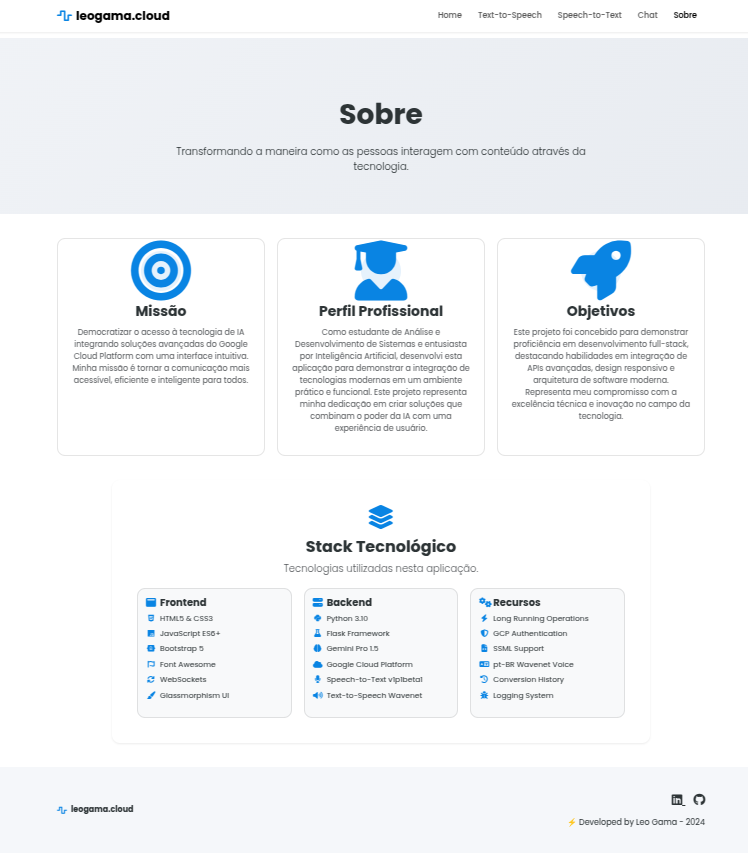

# AI Communication Hub 🚀

A modern web application that integrates advanced AI technologies to transform how people interact with digital content. Combining the power of Google Cloud Platform with an intuitive interface, we offer voice and text conversion capabilities, plus intelligent interactions through Gemini Pro.




## ✨ Features

### 🎙️ Speech-to-Text
Convert audio to text with high accuracy using Google Cloud Speech-to-Text v1p1beta1 advanced technology.
- Native Brazilian Portuguese support
- Long audio processing
- Conversion history
- Intuitive interface



### 🔊 Text-to-Speech
Transform text into natural audio using Google Cloud Text-to-Speech Wavenet voice.
- Natural Brazilian Portuguese voice
- SSML support for advanced control
- Asynchronous processing for long texts
- Conversion history



### 🤖 Intelligent Chat
Interact with Gemini Pro 1.5 through a friendly interface.
- Intelligent contextual responses
- Natural language processing
- Modern chat interface
- Conversation history



## 🛠️ Technology Stack

### Frontend
- HTML5 & CSS3
- JavaScript ES6+
- Bootstrap 5
- Font Awesome
- WebSockets
- Glassmorphism UI

### Backend
- Python 3.10
- Flask Framework
- Gemini Pro 1.5
- Google Cloud Platform
  - Speech-to-Text v1p1beta1
  - Text-to-Speech Wavenet

### Features
- Long Running Operations
- GCP Authentication
- SSML Support
- pt-BR Wavenet Voice
- Conversion History
- Logging System



## 🚀 Getting Started

### Prerequisites
- Python 3.10+
- Google Cloud Platform Account
- GCP Credentials configured
- Gemini Pro API Key

### Installation

1. Clone the repository
```bash
git clone [REPOSITORY_URL]
cd [DIRECTORY_NAME]
```

2. Install dependencies
```bash
pip install -r requirements.txt
```

3. Configure environment variables
```bash
cp .env.example .env
# Edit the .env file with your credentials
```

4. Configure Google Cloud credentials
```bash
# Place your credential files in the project root:
# - credential_stt_gcp.json for Speech-to-Text
# - credentials.json for Text-to-Speech
```

5. Start the application
```bash
python app.py
```

## 📝 License

This project is under the MIT license.

## 👤 Author

Leo Gama
- GitHub: [@LeoGamaJ](https://github.com/LeoGamaJ)
- Email: leo@leogama.cloud 
- LinkedIn: (https://www.linkedin.com/in/leonardo-gama-jardim/)
